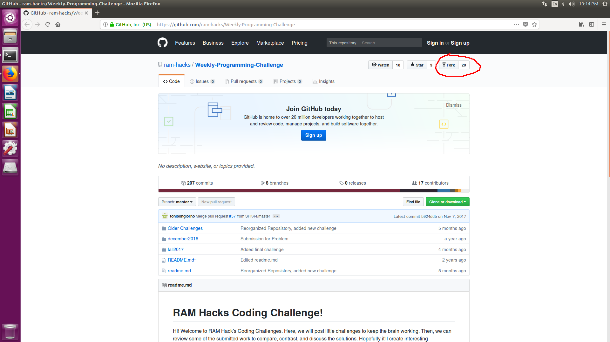
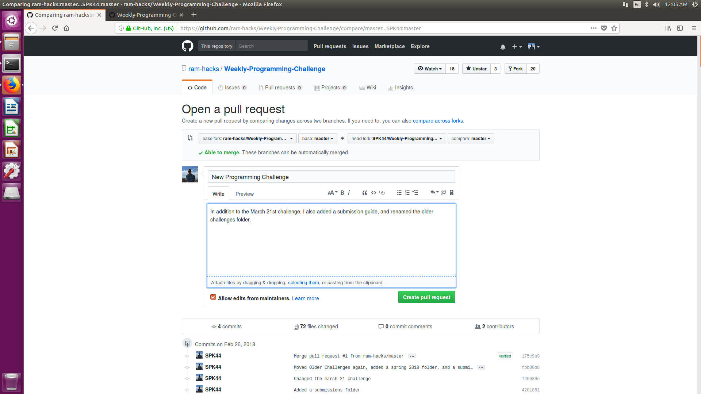

# Guide for Submitting to programming Challenge

## Step 1 : Create an Account

First you will need an account on github, if you do not have one already, just head on over to the [Sign Up page](https://github.com/join) to create an account. I won't walk you through this, however paid plans are not necessary to use github. So I do not recommend buying one unless you know what you are doing

## Step 2 : Forking the Programming Challenges Repository

Unlike git repositories you may have pushed to in the past, the RAM Hacks repository is protected. What does that mean? Essentially it means that before your code submission is shown here, a club admin will need to review the code, and accept or reject it (We almost always accept, don't worry).

You must navigate to the [RAM Hacks Programming Challenge Repository](https://github.com/ram-hacks/Weekly-Programming-Challenge) to *fork* the repository. **You must do this while logged in**. I will provide a picture of where the link is. 



## Step 3 : Making Changes

### The *terminal* way (cooler)

Let's start by cloning your repository. First you will need to find the URL of the fork that you created. Navigate to your repositories, and look for your fork of the Weekly-Programming-Challenge. It will look something like this github.com/\[**your username here!!!**\]/Weekly-Programming-Challenge. Then you can execute this command:

``` bash
git clone github.com/\[**your username here!!!**\]/Weekly-Programming-Challenge
```

Now you have the repository in your current directory. Type:

``` bash
ls
```

You'll then see the directory, you can use `cd` to enter that directory.

Next you'll need to edit the files (Create a Submission). You are free to use any text editor you want to write source code, but the only *real* choice is vim.

Next you'll need to stage your changes. While you are in any folder of the repository you can run:

``` bash
git status
```

This will show you what files have been changed. You will then need to add them using :

``` bash
git add [Files]
```

Where Files are the file names that you want to commit. You can also just do `git add .` to add everything in the current directory and subdirectories. Then you can actually commit the changes:

``` bash
git commit -m "Some random commit message, you should change this"
```

Finally you should push these changes

``` bash
git push
```

You're changes should now be on the github, **only for your fork**. You are not done yet.

### The *GUI* way (not as cool)

To be written. I will be using [Source Tree](https://www.sourcetreeapp.com/) to do this.

## Step 4 : Submit a pull request

Once you are satisfied with your changes, you can go back to the main page of your fork, github.com/\[**your username here!!!**\]/Weekly-Programming-Challenge, and click *New Pull Request*. Once you submit a pull request, one of the club admins will review your change and hopefully accept it. You can look at an example of this below.


